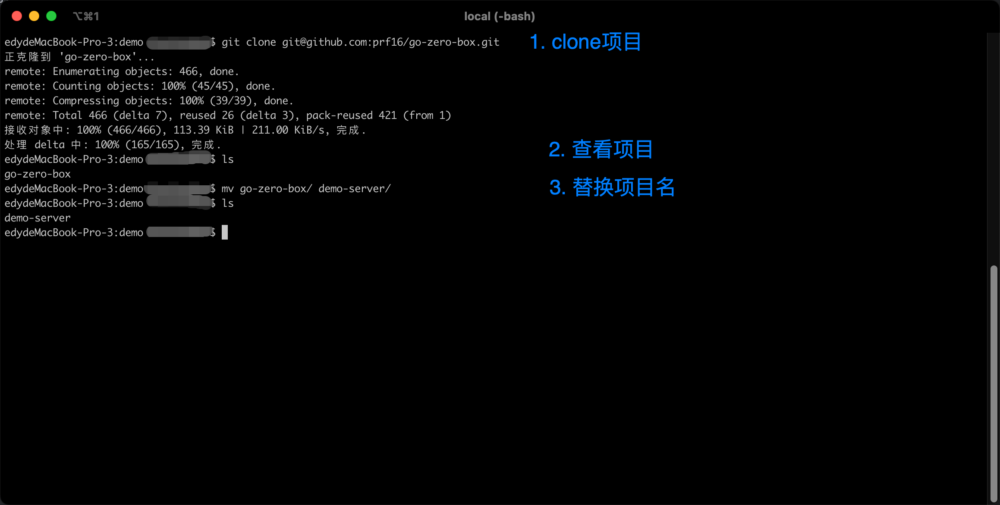
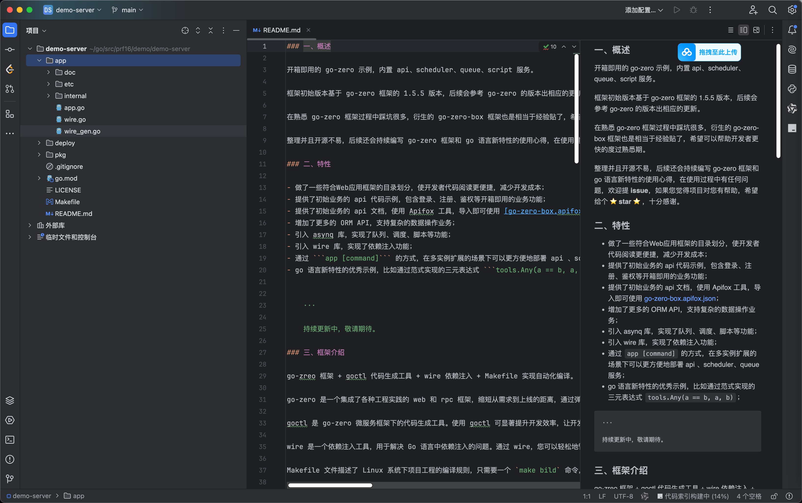
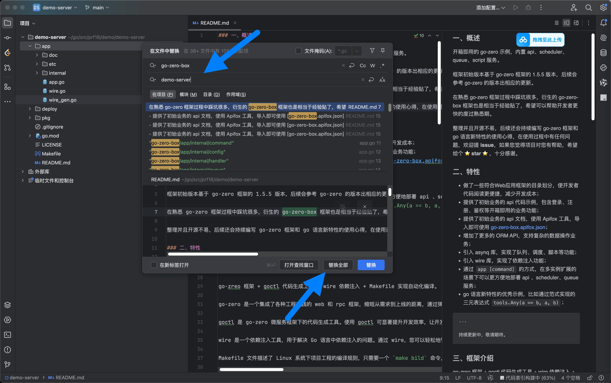
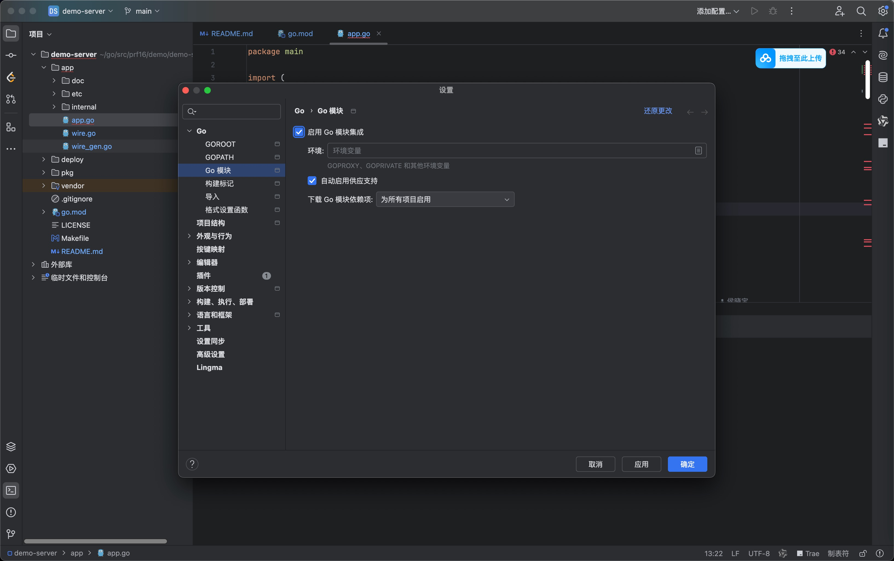
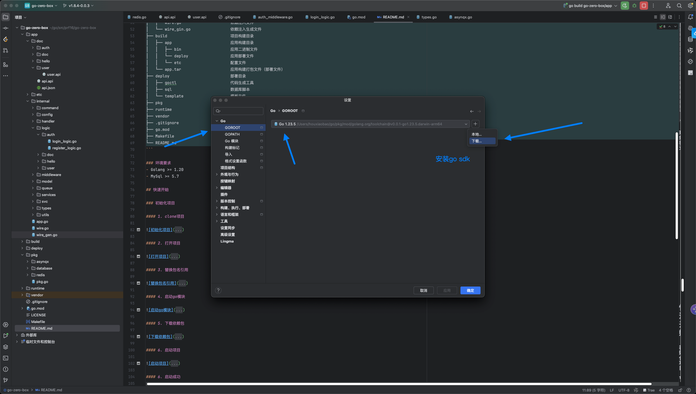
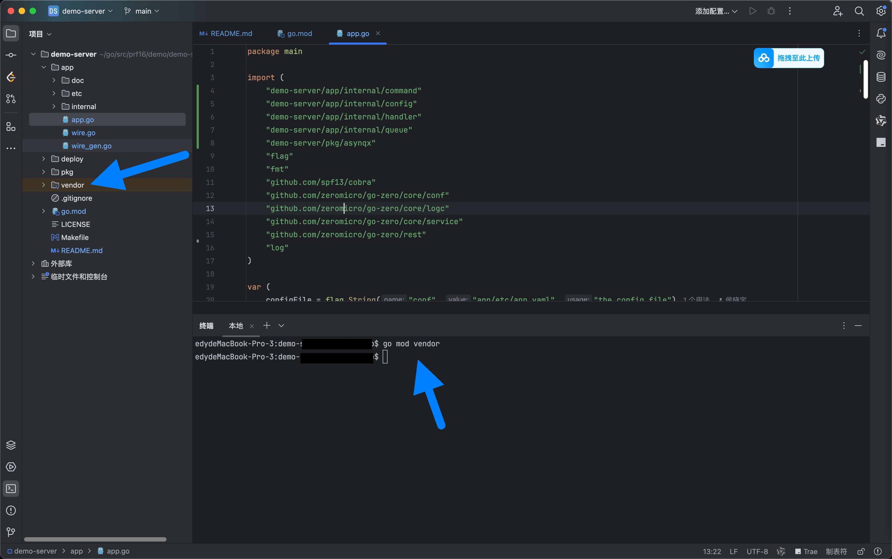
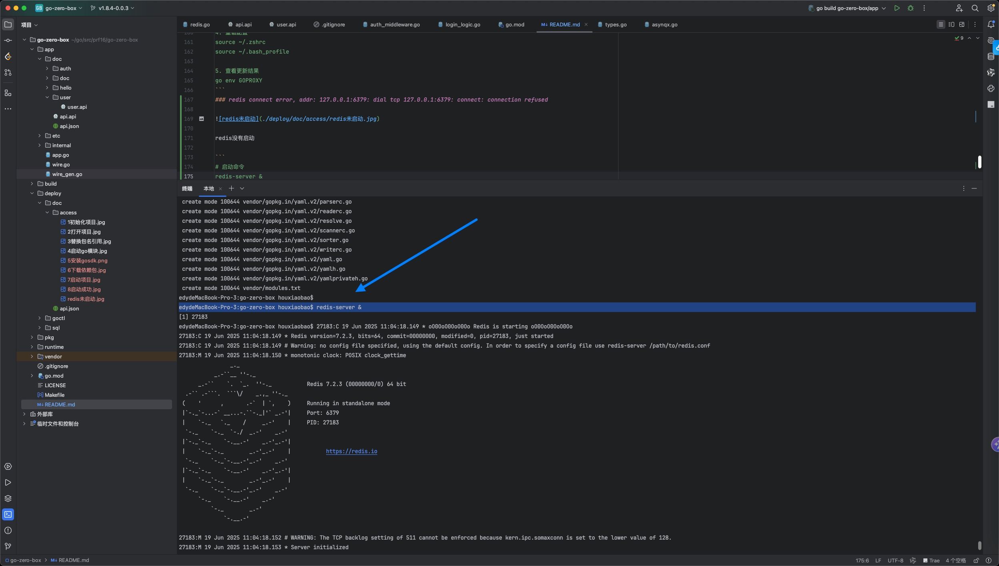
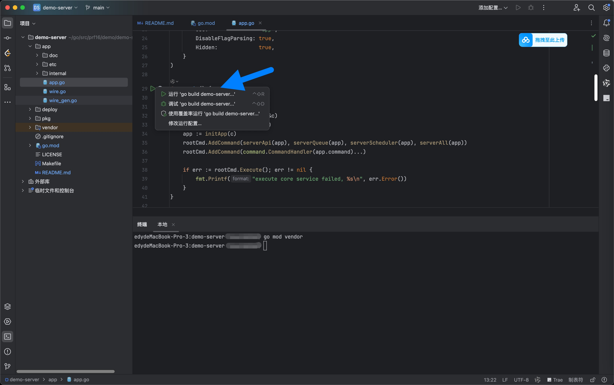
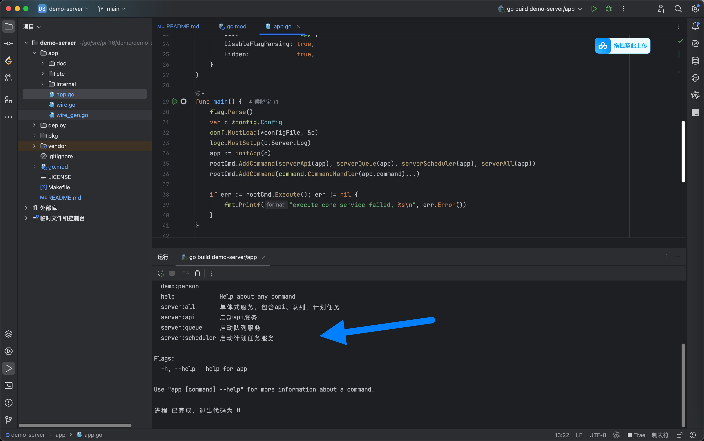

## 概述

### 背景

go-zero 的实战级工程模板 go-zero-box，我是一个使用过 go-zero 框架开发过多个商业项目的开发者，在熟悉 go-zero 框架过程中踩坑很多，衍生的 go-zero-box 框架也是相当于经验贴了，希望可以帮助开发者更快的度过熟悉期。

整理并且开源不易，后续还会持续编写 go-zero 框架和 go 语言新特性的使用心得，在使用过程中有任何问题，欢迎提 **issue**，如果您觉得项目对您有帮助，希望给个️ ⭐️ **star** ⭐️ ，十分感谢。

### go-zero 简介

go-zero 官方描述的非常清楚，不太了解的同学可以移步链接，官方文档：[go-zero](https://go-zero.dev)。

go-zero 的背景，它是由万俊峰（Kevin Wan）主导研发并开源，他现任七牛云技术副总裁，20 年 + 后端 / 架构经验。

go-zero 框架支持：

应用层
- api 服务
- rpc 服务

中间件
- 基础设施组件
    - 日志组件 logx
    - 链路追踪 trace
    - 服务监控 Prometheus
    - 接口文档 swagger
    ...
- 数据层组件
    - mysql
    - redis
    - mongo
- 高可用组件 
    - 负载均衡
    - 熔断器
    - 限流器
    ...

### go-zero-box 简介

基于 go-zero 框架的 1.9.4 版本、goctl 1.9.2 版本.

go-zero-box 是一套基于 go-zero 的实战级工程模板，开箱即用，包含 api、scheduler、queue、script 服务。

它不是新框架，是将实战中反复验证过的工程结构、服务拆分方式、通用能力设计，沉淀为一套可直接阅读、可直接落地的项目工程模板。

如果你正在使用 go-zero 构建真实业务系统，并希望项目从第一天起就具备良好的结构、清晰的边界和可维护性，那么 go-zero-box 可以帮助你少走大量工程弯路。

配套的 gRPC 服务模板请参考 [go-zero-box-rpc](https://github.com/prf16/go-zero-box-rpc)，两者配合使用构成完整的微服务体系。

go-zero-box 框架支持：

应用层
- queue 服务（使用 asynq 库实现队列功能）
- scheduler 服务（使用 asynq 库实现任务调度）
- command 服务（使用 cobra 包实现命令行工具 CLI 开发)

中间件
- 基础设施组件
    - 依赖注入 wire
- 基础设施扩展组件
    - 多 mysql 支持
    - 多 redis 支持
    - 多 rpc client 支持
    - 使用 app/internal/svc/utils/result 包实现统一响应结构和堆栈信息打印
- Makefile 规则组件（参考 make 命令信息)

好了，准备好开始了吗！

### 特性

- go-zero 框架 + goctl 代码生成工具 + wire 依赖注入 + Makefile 实现自动化编译；
- 做了一些符合Web应用框架的目录划分，使开发者代码阅读更便捷，减少开发成本；
- api 服务 dsl 描述文件的目录拆分；
- 支持多库，多redis，多 rpc client；
- 提供了初始业务的 api 代码示例，包含登录、注册、鉴权等开箱即用的业务功能；
- 提供了 go-zero 支持的 Swagger api 文档服务，**访问/api/doc即可预览文档**；
- 增加了更多的 ORM API，支持复杂的数据操作业务；
- svc 服务上下文的扩展，聚合所有依赖；
- 引入 asynq 库，实现了队列、调度、脚本等功能；
- 引入 wire 库，实现了依赖注入功能；
- 通过 ```app [command]``` 的方式，在分布式场景下可以更方便地部署 api 、scheduler、queue 服务；
- go 语言新特性的优秀示例，比如通过泛型实现的三元表达式 ```tools.Any(a == b, a, b)```；


    ···
    
    持续更新中，敬请期待。

### 环境要求
- Golang >= 1.23
- MySQL >= 5.7
- Redis


### 代码结构

```text
.
├── api                                api 描述文件
│   ├── api.api                        主入口，import 各模块 api
│   ├── auth/                          认证模块 api 定义
│   ├── hello/                         示例模块 api 定义
│   └── user/                          用户模块 api 定义
├── app                                包含应用程序的主要代码
│   ├── doc                            接口文档目录
│   ├── etc                            静态配置文件目录
│   ├── internal                       内部业务逻辑
│   │   ├── config/                    配置结构定义
│   │   ├── handler/                   HTTP 路由处理器
│   │   │   ├── auth/                  认证相关（登录、注册）
│   │   │   ├── doc/                   API 文档
│   │   │   ├── hello/                 示例接口
│   │   │   ├── user/info/             用户信息
│   │   │   └── routes.go             路由注册入口
│   │   ├── logic/                     业务逻辑层（按模块分子目录）
│   │   ├── middleware/                中间件（认证鉴权、请求日志）
│   │   ├── svc/                       服务上下文与依赖注入
│   │   │   ├── command/               CLI 脚本命令（可注册为计划任务）
│   │   │   ├── model/                 数据模型层（usermodel、messagemodel）
│   │   │   ├── queue/                 异步队列消费者（邮件、短信、微信）
│   │   │   ├── services/              业务服务层
│   │   │   ├── utils/                 工具函数（加密、响应、常量等）
│   │   │   └── service_context.go     服务上下文，聚合所有依赖
│   │   └── types/                     请求/响应类型定义（goctl 生成）
│   ├── app.go                         应用程序的入口文件，定义了 api、scheduler、queue、script 服务
│   ├── wire.go                        依赖注入定义文件
│   └── wire_gen.go                    依赖注入生成文件（自动生成，勿手动编辑）
├── build                              项目构建目录
│   ├── app                            应用构建后的目录
│   │   ├── doc                        接口文档目录
│   │   ├── etc                        配置文件目录
│   │   └── app                        应用二进制文件
│   └── app.tar                        应用构建后的打包文件
├── deploy                             部署相关目录
│   ├── access                         示例图片
│   ├── goctl                          goctl 代码生成模板文件
│   └── sql                            初始化数据库SQL
├── pkg                                工具包（可跨项目复用）
│   ├── asynqx/                        Asynq 异步队列封装（客户端、队列、调度器）
│   ├── cobrax/                        Cobra 命令扩展类型定义
│   ├── database/                      数据库连接封装（支持多库）
│   ├── redis/                         Redis 连接封装（支持多实例）
│   └── rpc/                           RPC 客户端封装（连接 go-zero-box-rpc）
├── runtime                            项目运行时目录（日志等）
├── vendor                             项目依赖包
├── .gitignore                         git 忽略文件
├── go.mod                             项目依赖管理文件
├── Makefile                           项目构建文件
└── README.md                          项目说明文件
```

## 安装开发工具

### wire

wire 是一个依赖注入工具，用于解决 Go 语言中依赖注入的问题。通过 wire，您可以轻松地管理应用程序的依赖关系，并确保它们在编译时进行注入。

```shell
# shell 安装
$ go install github.com/google/wire/cmd/wire@latest

# 验证安装
$ wire
```

### goctl 安装

goctl 是 go-zero 微服务框架下的代码生成工具。使用 goctl 可显著提升开发效率，让开发人员将时间重点放在业务开发上，其功能有：api服务生成、rpc服务生成、model代码生成、模板管理。

```shell
# 方式一（推荐）：shell 安装
$ go install github.com/zeromicro/go-zero/tools/goctl@v1.9.2

# 方式二：手动下载安装
https://github.com/zeromicro/go-zero/releases/tag/tools%2Fgoctl%2Fv1.9.2

# 验证安装
$ goctl --version
```

## Make 命令介绍

Makefile 文件描述了项目工程的编译规则，只需要一个 `make build` 命令，整个工程就开始自动构建项目环境，不再需要手动执行大量的 `go build` 命令，Makefile 文件定义了一系列规则，指明了源文件的编译顺序、依赖关系、是否需要重新编译等，可以输入 `make help` 查看命令集。

```
# 查看 make 信息
$ make

# 构建并打包应用（根据 env=dev|test|prod 编译，生成 build/app 及 app.tar）
$ make build env=dev

# 根据 api.api 定义生成 Go API 代码与 Swagger 文档
$ make api

# 根据 wire.go 生成依赖注入代码（wire_gen.go）
$ make wire

# 根据 MySQL 表结构生成 Go Model 代码
$ make model
```

## 服务启动命令

项目通过 Cobra 实现了多服务管理，支持以下子命令：

```shell
# 启动 API 服务
$ ./app server:api

# 启动队列消费服务
$ ./app server:queue

# 启动计划任务服务
$ ./app server:scheduler

# 启动全部服务（单体模式，包含 api、队列、计划任务）
$ ./app server:all

# 执行自定义脚本命令（示例）
$ ./app hello:world
```

开发阶段可以通过 `-conf` 参数指定配置文件路径：

```shell
$ go run main.go server:api
```

## 配置文件说明

配置文件位于 `app/etc/app.yaml`，各配置段说明如下：

| 配置段 | 说明 |
|--------|------|
| `Server` | go-zero REST 服务配置，包括服务名称、监听地址、端口、超时时间、日志配置等 |
| `Redis` | Redis 连接信息，包括地址、类型（node/cluster）、密码 |
| `Database` | MySQL 数据库连接字符串，支持多库配置 |
| `JwtAuth` | JWT 认证配置，包括签名密钥（AccessSecret）和过期时间（AccessExpire，单位：秒） |
| `UserRpc` | RPC 服务连接地址，用于连接 go-zero-box-rpc 服务 |

## 快速开始示例

### 1. clone项目



### 2. 打开项目



### 3. 替换包名引用



### 4. 启动go模块



### 5. 安装gosdk



### 6. 下载依赖包



### 7. 启动redis



### 8. 启动项目



### 9. 启动成功




## 常见问题
### 1. go mod tidy 超时 i/o timeout
```
1. 确认当前shell
echo $SHELL

2. 编辑相应的 Shell 配置文件
a. 如果使用 zsh
vim ~/.zshrc

a. 如果使用 bash
vim ~/.bash_profile

3. 添加配置信息
export GOPROXY=https://proxy.golang.org,https://mirrors.aliyun.com/goproxy/,direct

4. 重载配置
source ~/.zshrc
source ~/.bash_profile

5. 查看更新结果
go env GOPROXY
```

## 许可证

本项目采用 Apache License 2.0 许可证 - 查看 LICENSE 文件了解详情